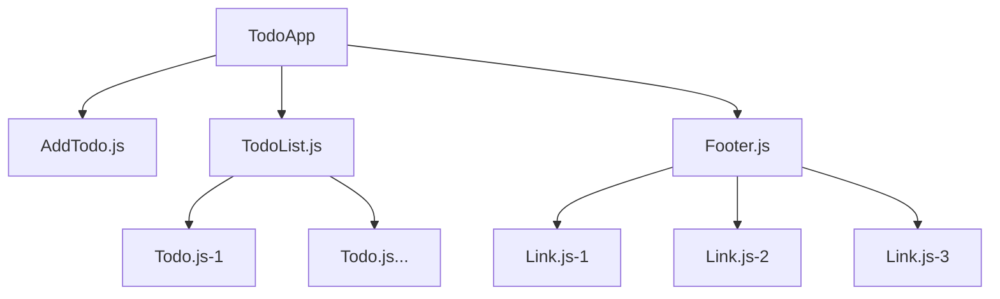

在前端学习的过程当中，很多文档里面都会以"待办事项"作为例子展开说明。在学习redux的过程中，我们也使用"待办事项"作为例子。在介绍"redux搭配react"之前，我们先来实现"待办事项"需求的UI界面。待办事项的具体需求如下：


1. 一个待办事项的列表(用todos数组存储)
   todos数组中的元素为待办事项内容，包含两个字段:
   
   {
       text: '待办事项1', // string
       completed: false,// boolean 是否完成的状态
   }
   
2. 一个过滤条件filter，filter是一个字符串，标明目前需要将哪些待办事项展现出来
   
    SHOW_ALL: 展示全部待办事项
    SHOW_COMPLETED: 展示已完成的待办事项
    SHOW_ACTIVE: 展示未完成的待办事项
   
3. 添加待办事项


原本想把本文的相关内容和"redux搭配react"融在一起。但是在梳理章节的时候，发现需要比较多的前置知识，融合在一起，"redux搭配react"文章就太长了，不方便阅读。所以我们把"'待办事项'项目UI实现"独立出来，方便后面的文章举例说明。

## 1、工程初始化

既然是作为一个基础功能，我们就将项目名称命名为"todo-base"。在任何一个目录下创建"todo-base"目录，执行如下操作:


> cd todo-base
# 初始化工程，按照步骤一步步填写
> npm init 


npm init 执行完成了之后，目录下面就会有 package.json文件，该文件是什么？？
我们的项目中，会有源代码文件，也会有编译出来的代码文件供发布线上。在项目根目录下创建"src"和"dist"两个目录，分别放置源代码文件和编译出来的代码文件。


- dist
- src
package.json


接着，我们在src目录下创建我们的第一个js文件(index.js)，一个简单的npm项目架子就完成了。


// index.js
document.write('Hello World!')


### 1.1 让项目跑起来
既然说简单的项目已经成型，那怎样让"Hello World!"的字样能够在浏览器中显示呢？我们在dist目录下创建index.html文件，添加基础的html代码，然后引入"index.js"文件。


<!DOCTYPE html>
<html lang="en">
<head>
    <meta charset="UTF-8" />
    <title>Document</title>
</head>
<body>
    
</body>
</html>


我们用浏览器打开index.html，就可以看到"Hello World!"的字样啦。

早先的web前端开发，就是这样的方式来进行的。只不过后来逐渐有了自动化打包的工具，这些步骤都通过打包实现了。后面将会看到我们是如何使用webpack将这个过程自动化的。

## 2、+ webpack

上一节中，我们在index.html中通过script标签，引入src/index.js，引入的是源文件。源文件直接引入到html当中，有几个方面的缺点：

1. 需要自己通过script标签手动引入js文件，不太灵活;
2. 这样引入的js文件，不能使用一些新的ES6、ES7特性，因为有些浏览器并不支持这些特性；
3. script引入的js文件，还需要处理缓存的问题；
4. 想要对js文件进行混淆压缩也不方便。

一般来说，现在的前端开发都会使用像webpack、gulp等这些打包工具。本文我们使用webpack来处理js文件，并自动打包输出到dist目录中，并添加上混淆压缩的功能。

### 2.1 webpack简单配置

webpack中有两个基本的概念："输入"(entry)、"输出"(output)。webpack会根据入口的配置，逐步解析各个资源文件（包括js文件、css文件、图片等）形成一个依赖图。依赖图中的每个依赖项都会被处理，然后根据出口（output）的配置输出到对应的文件中。在我们的例子中，入口文件就是index.js，输出到"dist"目录下，所以webpack简单配置如下(在项目根目录下创建webpack.config.js文件)：


// webpack.config.js
const path = require('path')
module.exports = {
    entry: {
        app: './src/index', // "app"key值可以随便定义，输出的时候就可以取这个key值为输出文件命名
    },
    output: {
        path: path.resolve(__dirname, './dist'),
        filename: '[name].js', // 这里[name]就对应entry中的‘app’key值
    }
}


当然我们要为项目添加webpack的npm包才能使用webpack来对文件进行打包处理。在命令行中输入：


// 确保当前处于项目根目录下再输入如下命令
> npm install -D webpack webpack-cli


当依赖包安装完成之后，我们就可以使用webpack进行打包了，使用命令行工具，输入如下命令：


// 确保当前处于项目根目录下再输入如下命令
> webpack


待webpack之行完成，我们会在dist目录下看到"app.js"文件对输出。

到此我们来看看解决来本节开篇所列问题对几个？貌似一个都没有解决！我们只是使用webpack对入口文件进行了简单的打包输出。但是不要泄气，只要使用了webpack，我们再来添加一些配置，上面的问题就可以得到解决。

### 2.2 使用webpack来解决问题

（1） 避免手动引入js文件&解决缓存问题

在前面的例子中js文件是通过script标签引入到html中使用的。而上一小节，我们通过webpack已经能将js文件打包输出。如果html文件也能通过webpack输出，那么是不是打包出来的js文件就能自动的引入到html文件中呢（毕竟webpack的输出配置是我们手动配置的）？答案是可以的。

此时，我们需要了解webpack的另一个概念"plugin"。plugin是对webpack功能的增强，让webpack能够做更多的事情。要让webpack能够输出html文件，我们需要使用到"html-webpack-plugin"。

首先，我们来安装“html-webpack-plugin”的npm依赖包。


> npm install -D html-webpack-plugin


接着修改webpack.config.js的配置：


// webpack.config.js
const path = require('path')
const HtmlWebpackPlugin = require('html-webpack-plugin')
module.exports = {
    entry: {
        app: './src/index', // "app"key值可以随便定义，输出的时候就可以取这个key值为输出文件命名
    },
    output: {
        path: path.resolve(__dirname, './dist'),
        filename: '[name].[chunkhash].js', // 这里[name]就对应entry中的‘app’key值
    },
    plugins: [
        new HtmlWebpackPlugin()
    ]
}


如上面的配置，除了添加plugins的配置外，还对output的filename配置改成了"[name].[chunkhash].js",这里chunkhash是基于内容的hash值，每当js源文件的内容发生改变时，chunkhash值也随之改变，这就可以解决引入js文件的缓存问题了。

（2）支持es6、es7特性

要让我们的代码支持es6、es7新特性。需要使用到webpack的loader功能，而能将es6、es7语法转换成浏览器支持的语法，就是"babel-loader"。要使用babel，我们需要先安装

- babel : babel库
- babel-loader：webpack用来加载babel的库
- @babel/core：babel库的核心
- @babel/preset-react：支持react的语法


> npm insall -D babel babel-loader @babel/core @babel/preset-react


在webpack.config.js中添加配置：


module.exports = {
    //...
    module: {
        rules: [
            {
                test: /\.js$/,
                use: 'babel-loader',
            }
        ]
    }
}


这个配置告诉webpack，当加载js文件时，使用babel-loader进行转换。而babel-loader会调用babel来实现转换。

不过上面的配置，仅仅使用了babel的核心功能，要让webpack支持更多的babel提供的功能，需要在项目根目录下创建babel的配置文件".babelrc"。然后往这个文件里面添加如下内容：


// .babelrc
{
    "presets": ["@babel/preset-react"]
}


这个配置告诉babel调用“@babel/preset-react”来支持react的语法。

### 2.3 开发环境支持

接着2.1和2.2节的配置，我们已经使用上了webpack对文件进行打包处理。但是我们在代码中是会使用到ES6、ES7的一些特性，在开发的时候，需要babel实时对代码进行编译输出才能看到开发的功能是否有问题。并且我们也不可能，开发一会，想看效果了然后webpack编译一下再用浏览器看结果，这样效率就太低了。

为了能实时能看到我们开发的功能，我们需要在本地起一个web服务，然后使用webpack监控文件的变化，当文件发生变化时立即执行webpack进行代码编译输出，发布到web服务上，这样我们在浏览器访问这个web服务的地址就能实时看到结果了。而这些，都可以通过webpack的devServer配置项来实现。看下面的配置：


// webpack.config.js
module.exports = {
    // ...
    devServer: {
        contentBase: path.join(__dirname, 'dist'), // web服务的目录为 "dist" 目录
        port: 9000 // web服务端口
    }
}


配置好之后，如何启动devServer呢？首先，我们需要先安装"webpack-dev-server"这个npm包。


// 确保当前处于项目根目录下再输入如下命令
> npm install -D webpack-dev-server


"webpack-dev-server"安装好之后，我们在命令行工具中输入"webpack-dev-server"即可启动服务了。


// 确保当前处于项目根目录下再输入如下命令
> webpack-dev-server


web服务启动之后，在浏览器打开 "http://localhost:9000" 就可以看到"Hello World"字样了。

## 3、+ react

在上一节，我们已经使用webpack将环境搭好了，接着我们就来添加react的代码。然后将"待办事项"的UI实现出来。我们先来安装react的依赖包。


> npm install -D react react-dom


在index.js中加入如下代码:


// ./src/index.js
import React from 'react'
import ReactDOM from 'react-dom'

import App from './app'

ReactDOM.render(
    <App />, 
    document.getElementsByTagName('BODY')[0],
)


index.js是入口文件，会在body标签下渲染react组件<App />。组件App的代码如下（我们先搭一个架子）：


// src/app.js
import React, { Component } from 'react';
class App extends Component {
    render() {
        return (
            
{'todo app'}

        )
    }
}
export default App


## 4、待办事项实现

待办事项的UI分为三个部分：添加待办事项、待办事项列表、待办事项过滤条件。下面我们一个部分一个部分来实现，然后再组合起来。

### 4.1 添加待办事项UI

待办事项的添加，我们只需要一个input输入框和一个添加的按钮。我們使用react的函数定义组件来实现：


// src/AddTodo.js
import React from 'react';

const AddTodo = () => {
    return (
        

            <input type="text" />
            <button type="button">Add</button>
        

    )
}

export default AddTodo


### 4.2 待办事项列表UI

待办事项的列表，由列表项构成。所以这里拆分成Todo.js和TodoList.js两个文件。


// src/Todo.js
const Todo = ({ onClick, completed, text }) => {
    const style = {textDecoration: completed ? 'line-through' : 'none'}
    return (
    <li
        onClick={onClick}
        style={style}
    >
        {text}
    </li>
    )
}



// src/TodoList.js
import React from 'react'

import Todo from './Todo'

const TodoList = ({todos, onTodoClick}) => (
    <ul>
        {todos.map((todo) => (
            <Todo key={todo.id} {...todo} onClick={() => { onTodoClick(todo.id) }}/>
        ))}
    </ul>
)
export default TodoList


### 4.3 待办事项列表过滤

待办事项有"完成"、"未完成"两种状态，在显示待办事项列表的时候，默认显示所有的待办事项，也可以进行过滤。如果用户点击"Active"链接，则显示"未完成"状态的待办事项，如果用户点击"Completed"链接，则显示"完成"状态的待办事项。

由于有三个链接，所以先定义链接的组件。


// src/Link.js
import React from 'react'

const Link = ({ active, children, onClick }) => {
    if (active) {
      return {children}
    }
    return (
      <a
        href=""
        onClick={e => {
          e.preventDefault()
          onClick && onClick()
        }}
      >
        {children}
      </a>
    )
}

export default Link


把三个链接组合起来，我们定义一个Footer.js文件。


import React from 'react';
import Link from './Link'
const Footer = () => (
    

        Show:
        <Link active={true}>ALL</Link>
        &nbsp;&nbsp;
        <Link active={false}>Active</Link>
        &nbsp;&nbsp;
        <Link active={false}>Completed</Link>
    

)
export default Footer


### 4.4 组合起来

上面几个小节，把几个模块的UI组件都定义好了。我们来修改app.js文件，把各个模块组合起来。


// src/app.js
import React, { Component } from 'react';

import AddTodo from './AddTodo'
import TodoList from './TodoList'
import Footer from './Footer'

// 模拟数据
const data = [
    {
        id: '1',
        text: '001',
        completed: false,
    },
    {
        id: '2',
        text: '002',
        completed: true,
    },
]

class App extends Component {
    constructor (props) {
        super(props)
        this.onTodoClick = this.onTodoClick.bind(this)
    }
    onTodoClick (id) {
        console.log('@@@@todo click', id)
    }
    render() {
        return (
            

                <AddTodo />
                <TodoList todos={data} onTodoClick={this.onTodoClick}/>
                <Footer />
            

        )
    }
}

export default App


具体的结构图如下：

# 5 结语

本文具体的代码可查看 。

现在的前端项目搭建，已经会涉及到很多知识。从本文可以看到，开发一个简单的UI，从项目搭建开始，我们使用到了npm来初始化项目，然后使用webpack来搭建环境，接着再组合react。而在webpack中，我们也会涉及到额外的npm包，如html-webpack-plugin、babel、babel-loader。丰富的工具让我们的开发变得简单高效，但是也增加了我们学习的成本。逐步积累，是不断进步的必经之路。